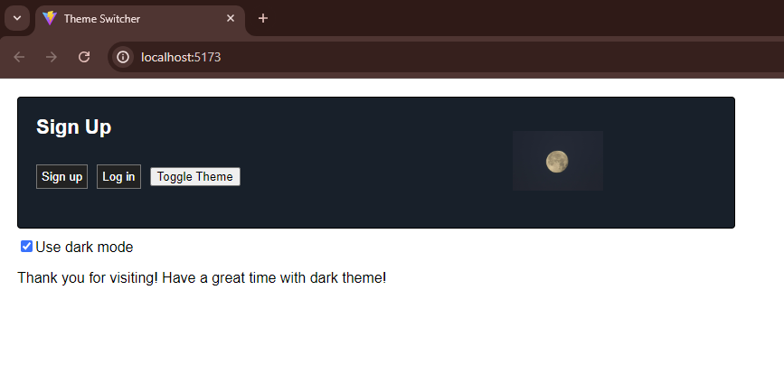
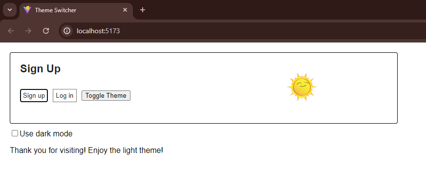

# React Theme Switcher

A recap of the original counter app exercise in Module 2 provided by Sigma School.

## Overview

I was tasked to create a theme-switcher function in my react application. During the project, I was exposed to render my content conditionally -- which taught me how to effectively use the ternary operator and other control-flow techniques. Upon page render, it will show a welcome text, but then will change to either signup or login depending on the button.

I got comfortable implementing the useContext hook so I can perform cross-component communication in my react app.

## Credit

Thank you to Sigma School for providing me the opportunity to career-switch into the tech field. Exercises/Lessons/Examples were provided by them. https://sigmaschool.co/
